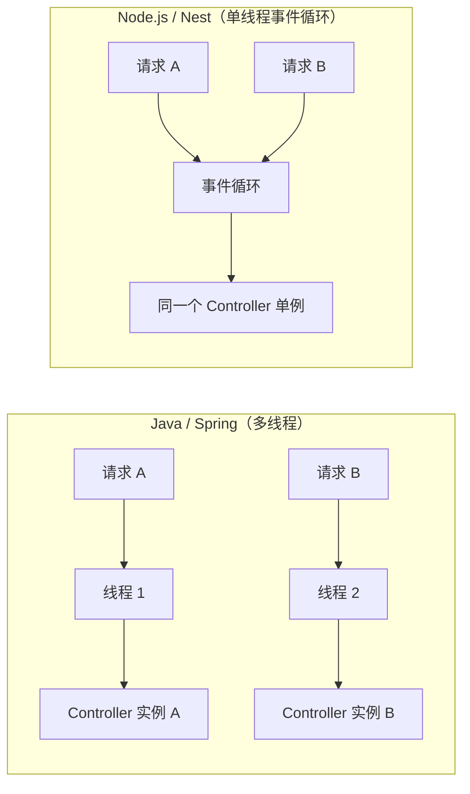

## 概念：

1. 控制器负责处理传入的**请求并将其响**应返回给客户端。职责是处理应用程序的特定请求。通常，**一个控制器包含多个路由**，每个路由可执行不同的操作。路由机制决定了每个请求应由哪个控制器处理。

## 路由

1. 路由路径：是通过将控制器声明的前缀（@Controller('cats')）与方法装饰器中指定的路径（@Get()）组合而成

```js

import { Controller, Get } from '@nestjs/common';

@Controller('cats')
export class CatsController {
  @Get()
  findAll(): string {
    return 'This action returns all cats';
  }
}
```

2. 状态代码装饰器：@HttpCode(200)
   > 响应的默认状态码始终为 200，但 POST 请求除外，其默认状态码为 201。您可以通过在处理程序级别使用 @HttpCode（...） 装饰器轻松更改此行为。
3. HTTP 方法提供了装饰器：

- @Get()
- @Post(), @Put(), @Delete(), @Patch(), @Options()以及@Head()、@All()

4. 路由通配符：用于匹配路径末尾路由中的任意字符组合

```js

@Get('abcd/*')
findAll() {
  return 'This route uses a wildcard';
}

```

5. Response headers 响应头#:

```js
@Post()
@Header('Cache-Control', 'no-store')
create() {
  return 'This action adds a new cat';
}
```

## 请求、响应对象

1. 请求对象的详情信息：https://expressjs.com/en/5x/api/request/
2. 响应对象的详情信息：https://expressjs.com/en/5x/api/response/
3. 使用装饰器获取请求体内的参数

| 装饰器                     | 底层对象                            |
| :------------------------- | :---------------------------------- |
| `@Request()`, `@Req()`     | `req`                               |
| `@Response()`, `@Res()` \* | `res`                               |
| `@Next()`                  | `next`                              |
| `@Session()`               | `req.session`                       |
| `@Param(key?: string)`     | `req.params` / `req.params[key]`    |
| `@Body(key?: string)`      | `req.body` / `req.body[key]`        |
| `@Query(key?: string)`     | `req.query` / `req.query[key]`      |
| `@Headers(name?: string)`  | `req.headers` / `req.headers[name]` |
| `@Ip()`                    | `req.ip`                            |
| `@HostParam()`             | `req.hosts`                         |

> 使用自定义装饰器的时候，当在方法处理器中注入@Res()或@Response()时，该处理器将进入库特定模式，此时开发者需自行管理响应处理。在此模式下，必须通过调用响应对象的方法（例如res.json（...）或res.send（...））发送某种形式的响应，否则HTTP服务器将陷入阻塞状态。

## 重定向 `@Redirect()`：

```js
@Get('go')
@Redirect('https://www.baidu.com/', 302)
redirect() {
  return 'This action redirects to baidu';
}
```

有时需要**动态**决定 HTTP 状态码或重定向 URL，可在处理方法中返回一个符合 `HttpRedirectResponse` 接口（来自 `@nestjs/common`）的对象，它会**覆盖** `@Redirect()` 装饰器上的静态配置：

```js
import { Controller, Get, Query, Redirect } from '@nestjs/common';
import type { HttpRedirectResponse } from '@nestjs/common';

@Controller('auth')
export class AuthController {
  // 场景：OAuth 登录回调，根据 query 参数动态决定跳转地址
  @Get('callback')
  @Redirect('/login', 302) // 兜底：装饰器上的静态配置
  callback(
    @Query('code') code: string,
    @Query('role') role: string,
  ): HttpRedirectResponse {
    // 没有 code → 跳回登录页并带上错误信息
    if (!code) {
      return {
        url: '/login?error=missing_code',
        statusCode: 302,
      };
    }

    // 有 code → 按角色跳转到不同后台
    const dashboards = {
      admin: '/admin/dashboard',
      user: '/user/home',
    };

    return {
      url: `${dashboards[role] ?? '/home'}?code=${code}`,
      statusCode: 307, // 307 保证 POST 等方法不被改成 GET
    };
  }
}
```

请求示例：

```bash
# 无 code → 302 到 /login?error=missing_code
GET /auth/callback

# 有 code + role=admin → 307 到 /admin/dashboard?code=abc123
GET /auth/callback?code=abc123&role=admin

# 有 code 但 role 未知 → 307 到 /home?code=abc123
GET /auth/callback?code=abc123&role=guest
```

> `HttpRedirectResponse` 接口：`{ url: string; statusCode?: number }`

## Sub-domain routing/子域路由

- @Controller装饰器可接受一个host选项，用于要求传入请求的HTTP主机名必须与某个特定值匹配。
- Fastify 不支持子域名路由
- @HostParam()装饰器： host选项也可使用占位符来捕获主机名中该位置的动态值

```js

@Controller({ host: ':account.example.com' })
export class AccountController {
  @Get()
  getInfo(@HostParam('account') account: string) {
    return account;
  }
}

```

## State sharing/状态共享机制

1. 核心结论：在 Nest 中，**几乎所有东西都是跨请求共享的**——包括 Controller 实例、Singleton Service、数据库连接池等。这是默认且推荐的设计。

2. 为什么安全：Node.js 采用**单线程事件循环**，而非 Java Servlet 那种「每个请求一个线程」的多线程模型。同一时刻只有一个 JS 线程执行业务代码，不会出现两个线程同时修改同一实例字段的竞态问题。因此使用 Singleton 是**完全安全**的。



3. 常见误区：不要把「当前请求的数据」存到 Controller / Service 的**实例字段**上，所有并发请求会共用该字段。

```js
// ❌ 错误：实例字段会被所有请求共享
@Controller('cats')
export class CatsController {
  private currentUserId: string;

  @Get()
  findAll(@Headers('user-id') userId: string) {
    this.currentUserId = userId; // 请求 A 未处理完，请求 B 可能覆盖
    return this.catsService.findByUser(this.currentUserId);
  }
}
```

4. 正确做法：

- 通过方法参数传递请求数据（`@Param`、`@Body`、`@Query`、`@Headers` 等）
- 将数据作为 Service 方法参数传入，而非存入实例属性

5. 何时需要「按请求」隔离：仅在少数场景需要 request scope，例如 GraphQL 按请求缓存、请求追踪（traceId）、多租户（multi-tenancy）。详见 [Injection scopes](https://docs.nestjs.com/fundamentals/injection-scopes)。

```js
import { Controller, Scope } from '@nestjs/common';

// Controller 按请求创建新实例
@Controller({
  path: 'cats',
  scope: Scope.REQUEST,
})
export class CatsController {}

// Service 按请求创建，并可注入当前请求对象
import { Injectable, Inject } from '@nestjs/common';
import { REQUEST } from '@nestjs/core';

@Injectable({ scope: Scope.REQUEST })
export class CatsService {
  constructor(@Inject(REQUEST) private request: Request) {}
}
```

> `Scope.REQUEST` 有性能开销，只在确实需要时使用，不要默认全开。

| 概念                | Spring（典型）              | NestJS（默认）               |
| :------------------ | :-------------------------- | :--------------------------- |
| Controller 生命周期 | 单例                        | **单例**                     |
| Service 生命周期    | 单例                        | **单例**                     |
| 请求隔离            | ThreadLocal / Request Scope | 参数传递，或 `Scope.REQUEST` |
| 并发模型            | 多线程                      | 单线程 + 异步 I/O            |

## Asynchronicity/异步处理机制#

1. Promise: 每个异步函数都必须返回一个Promise对象，这使得您能够返回一个延迟值，而 Nest 可自动解析该值

```js

@Get()
async findAll(): Promise<any[]> {
  return [];
}

```

2. RxJS observable streams : https://rxjs-dev.firebaseapp.com/guide/observable

- nest允许路由处理程序返回RxJS可观察流（observable streams）。Nest会内部处理订阅逻辑，并在流结束时解析最终发射的值。

```js

@Get()
findAll(): Observable<any[]> {
  return of([]);
}

```

## 参考文档

- https://docs.nestjs.com/controllers
