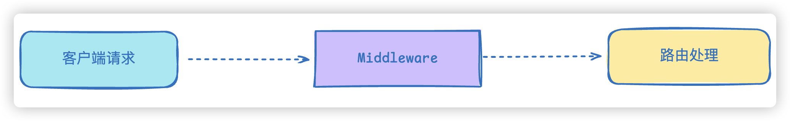
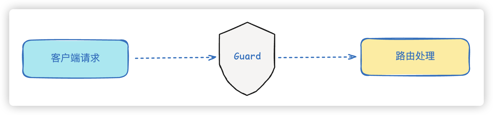

## AOP在Nest中的应用

### 1、中间件

中间件是 Express 里的概念，Nest 的底层默认是 Express，它在请求流程中的位置大致如下：



**中间件**可以在**路由处理程序之前**或者**之后插入**需要执行的任务，Nest做了进一步细分，主要分为**全局中间件**和**局部中间件**

我们可以通过命令**nest g mi [中间件名称]**直接来创建中间件，比如`nest g mi person`就会自动帮我们在`person`文件夹下创建`person.middleware.ts`文件

**person.middleware.ts**

```typescript
import { Injectable, NestMiddleware } from "@nestjs/common";
import { Request, Response, NextFunction } from "express";

@Injectable()
export class PersonMiddleware implements NestMiddleware {
  use(req: Request, res: Response, next: NextFunction) {
    console.log("before 中间件 ---" + req.url);
    next();
    console.log("after 中间件 ---" + res.statusCode);
  }
}
```

当然，默认生成的参数`req`，`res`类型都是`any`，next就是一个默认函数`() => void`我们可以加上`express`对应的相关类型。

我们可以在person模块中调用中间件

**person.module.ts**

```typescript
import { MiddlewareConsumer, Module, NestModule } from "@nestjs/common";
import { PersonService } from "./person.service";
import { PersonController } from "./person.controller";
import { PersonMiddleware } from "./person.middleware";

@Module({
  controllers: [PersonController],
  providers: [PersonService],
})
export class PersonModule implements NestModule {
  configure(consumer: MiddlewareConsumer) {
    consumer.apply(PersonMiddleware).forRoutes(PersonController);
  }
}
```

当然，我们也可以像下面一样，`指定特定的路由`：

```typescript
import {
  MiddlewareConsumer,
  Module,
  NestModule,
  RequestMethod,
} from "@nestjs/common";
import { PersonService } from "./person.service";
import { PersonController } from "./person.controller";
import { PersonMiddleware } from "./person.middleware";

@Module({
  controllers: [PersonController],
  providers: [PersonService],
})
export class PersonModule implements NestModule {
  configure(consumer: MiddlewareConsumer) {
    consumer.apply(PersonMiddleware).forRoutes({
      path: "/person",
      method: RequestMethod.GET,
    });
  }
}
```

当我们访问/person时，后端打印如下效果：

```text
before 中间件 ---/person
person controller
after 中间件 ---200
```

在Nest中，`类中间件不仅可以处理HTTP请求和响应，更重要的是，它能够实现依赖注入。这意味着我们可以在中间件中注入特定的依赖项，并且调用这些依赖项内部的方法`。比如:

```typescript
import { Inject, Injectable, NestMiddleware } from "@nestjs/common";
import { Request, Response, NextFunction } from "express";
import { UserService } from "src/user/user.service";
import { PersonService } from "./person.service";

@Injectable()
export class PersonMiddleware implements NestMiddleware {
  @Inject(PersonService)
  private personService: PersonService;

  use(req: Request, res: Response, next: NextFunction) {
    console.log("before 中间件 ---" + req.url);
    console.log("调用注入的服务 ---" + this.personService.findAll());
    next();
    console.log("after 中间件 ---" + res.statusCode);
  }
}
```

当然，如果不需要依赖注入的话，也能使用轻量的函数中间件，就和定义普通函数差别不大

```typescript
export function PersonMiddleware(
  req: Request,
  res: Response,
  next: NextFunction,
) {
  console.log("before 函数中间件 ---" + req.url);
  next();
  console.log("after 函数中间件 ---" + res.statusCode);
}
```

除了在局部引用，也能**直接在全局引用**，作为全局中间件使用，比如，我创建一个logger中间件，`nest g mi logger`

```typescript
import { Injectable, NestMiddleware } from "@nestjs/common";
import { Request, Response, NextFunction } from "express";
@Injectable()
export class LoggerMiddleware implements NestMiddleware {
  use(req: Request, res: Response, next: NextFunction) {
    console.log("before 全局中间件 ---" + req.url);
    next();
    console.log("after 全局中间件 ---" + res.statusCode);
  }
}
```

在main.ts中全局引入

```typescript
import { NestFactory } from "@nestjs/core";
import { AppModule } from "./app.module";
import { LoggerMiddleware } from "./logger/logger.middleware";

async function bootstrap() {
  const app = await NestFactory.create(AppModule);
  app.use(new LoggerMiddleware().use);
  await app.listen(8088);
}
bootstrap();
```

### 2、守卫

守卫的职责一般很明确，`通常用于权限、角色等授权操作`，守卫所在的位置与中间件类似，可以对请求进行拦截和过滤，其实，Guard 就可以理解为**路由守卫**的意思，可以用于在调用某个 Controller 之前判断权限，返回 **true** 或者 **false** 来决定是否放行



**守卫在调用路由程序之前返回`true`或者`false`来判断是否通行**，同样分为**全局守卫**和**局部守卫**

同样，我们可以使用命令**nest g gu [守卫名称]**来创建守卫模块，比如：`nest g gu person`就会自动帮我们在`person`文件夹下创建`person.guard.ts`文件

要作为一个守卫，必须实现`CanActive`接口中的`canActivate()`方法

**person.guard.ts**

```typescript
import { CanActivate, ExecutionContext, Injectable } from "@nestjs/common";
import { Observable } from "rxjs";

@Injectable()
export class PersonGuard implements CanActivate {
  canActivate(
    context: ExecutionContext,
  ): boolean | Promise<boolean> | Observable<boolean> {
    console.log("person guard");
    return true;
  }
}
```

如果我们进行局部绑定，可以直接在`Controller`类上添加装饰器`@UseGuards`

```typescript
@Controller('person')
@UseGuards(PersonGuard)
export class PersonController {......}
```

这样，当我们访问`/person`时，打印如下效果：

```text
before 中间件 ---/person
person guard
after 中间件 ---200
person controller
```

但是如果在`canActivate`方法中返回的是`false`，就会是如下效果

```typescript
{"message":"Forbidden resource","error":"Forbidden","statusCode":403}
```

`Controller` 本身不需要做啥修改，**却透明的加上了权限判断的逻辑，这就是 AOP 架构的好处**

而且，就像 Middleware 支持全局级别和路由级别一样，**Guard 也可以全局启用**

```diff
async function bootstrap() {
  const app = await NestFactory.create(AppModule);
  app.use(new LoggerMiddleware().use);
+  app.useGlobalGuards(new PersonGuard());
  await app.listen(8088);
}
bootstrap();
```

这样每个路由都会应用这个 Guard。

但是，**注意**，这种方式是通过自己**new的 Guard 实例，不在 IoC 容器里**。这会造成什么问题呢？由于没有在IoC容器中所以，当然无非获取从容器中注入的内容，比如像下面的代码：

```typescript
@Injectable()
export class PersonGuard implements CanActivate {
  @Inject(PersonService)
  private personService: PersonService;

  canActivate(
    context: ExecutionContext,
  ): boolean | Promise<boolean> | Observable<boolean> {
    console.log("person guard ---" + this.personService.findAll());
    return true;
  }
}
```

在`PersonGuard`中引入了`PersonService`，但是这需要从IoC容器中进行注入，而我们的`PersonGuard  是自己new出来的，并没有被IoC容器所托管，因此，在这里是用不了`PersonService对象的，会在后台直接报错，直接前台提示500错误。

```typescript
ERROR [ExceptionsHandler] Cannot read properties of undefined (reading 'findAll')

{"statusCode":500,"message":"Internal server error"}
```

所以，Nest还给我们提供了**另外一种全局注册方式**，在 AppModule 里声明，**当然记得把之前new的Guard实例注释掉**：

```diff
+import { APP_GUARD } from '@nestjs/core';
+import { PersonGuard } from './person/person.guard';

@Module({
  imports: [UserModule, PersonModule],
  controllers: [AppController, PersonController],
  providers: [
    AppService,
    PersonService,
+   {
+      provide: APP_GUARD,
+      useClass: PersonGuard,
+    },
  ],
})
export class AppModule {}
```
### 中间件与路由守卫的区别及使用场景

中间件和守卫都是 Nest AOP 请求链上的横切能力，但职责、API 和执行时机不同。

#### 1、在请求链中的位置

一次 HTTP 请求的大致顺序为：**中间件 → 守卫 → 拦截器 → 管道 → Controller**。

访问 `/person` 时，控制台输出顺序为：

```text
before 中间件 ---/person
person guard
after 中间件 ---200
person controller
```

说明：中间件最先执行；调用 `next()` 后才会进入守卫和后续流程；`next()` 之后的代码会在下游处理完成后再执行（类似 Express 的「环绕」逻辑）。

#### 2、核心区别

| 维度 | 中间件 (Middleware) | 守卫 (Guard) |
| --- | --- | --- |
| 来源 | Express 概念，Nest 沿用 | Nest 专有，可理解为**路由守卫** |
| 主要职责 | 在路由处理前后插入通用逻辑 | **权限、角色等授权**，决定能否进入 Controller |
| 继续方式 | 调用 `next()` 放行 | `canActivate()` 返回 `true` / `false` |
| 拒绝时 | 自行 `res` 结束或不调 `next()` | 返回 `false` → 默认 **403 Forbidden** |
| 接口 | `NestMiddleware.use(req, res, next)` | `CanActivate.canActivate(context)` |
| 上下文 | 原生 Express `Request` / `Response` | `ExecutionContext`（可拿到路由、方法、请求体等） |
| 注册方式 | 模块 `configure(consumer)`、`app.use()` | `@UseGuards()`、`useGlobalGuards()`、`APP_GUARD` |
| 与 Handler 关系 | 偏底层，与具体 Handler 无关 | 面向「能否执行这个路由」，适合鉴权 |

#### 3、使用场景

**中间件** —— 通用、与具体路由 Handler 无关的横切逻辑：

- 请求日志（如全局 `LoggerMiddleware`）
- 请求预处理：解析 body、统一 header、CORS 等
- 在路由前后做事：`next()` 前打日志，`next()` 后根据 `res.statusCode` 做收尾
- 需要依赖注入时，使用**类中间件**并在模块中 `consumer.apply().forRoutes()` 注册

**守卫** —— 授权与访问控制：

- 是否登录（JWT / Session 校验）
- 角色、权限判断（admin / user 等）
- 在**进入 Controller 之前**统一拦截，Controller 无需重复写鉴权逻辑（AOP 的好处）

返回 `false` 时，客户端收到 403：

```json
{"message":"Forbidden resource","error":"Forbidden","statusCode":403}
```

#### 4、注册时的注意点

- **中间件**：类中间件支持 DI；函数中间件轻量、无 DI；`app.use(new XxxMiddleware().use)` 为自行 `new`，不在 IoC 容器内。
- **守卫**：`app.useGlobalGuards(new PersonGuard())` 同样不在 IoC 容器内，`@Inject()` 会失败；需要**全局 + DI** 时，应在 `AppModule` 中使用 `APP_GUARD` + `useClass`。

#### 5、如何选型

- **中间件**：处理「这条 HTTP 请求本身」的通用逻辑（日志、解析、改写请求），不关心「当前用户能不能调这个 Handler」。
- **守卫**：处理「能不能执行这个路由」的**授权**问题，用 `true/false` 放行。

两者常配合使用：例如中间件解析 token 并挂到 `req` 上，守卫再读取 token 做权限判断，通过后进入 Controller。