## docker中的快速安装

在这里，我并不会对docker大谈特谈，因为在这里，我们只是把docker当做一个很方便的开发工具进行使用，如果你还不熟悉docker，可以简单理解为，docker就是一个方便帮你安装linux上各种应用的容器即可，不用你去费心的还要去安装linux，或者安装虚拟机，然后费心的配置各种环境，docker直接帮你把应用的整个环境打包好了。

为了让没有接触过docker的同学快速上手，这里也不打算一一去介绍docker的各种繁杂的命令，我们可以直接去安装docker桌面版应用程序，可以让我们直接傻瓜式的直接使用docker。

所以，首先我们去下载安装[docker](https://www.docker.com/)的桌面版的安装程序

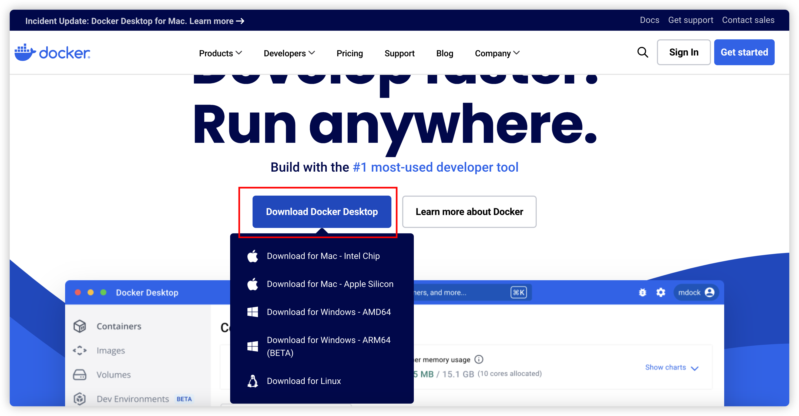

当然，要使用docker，需要特殊的网络环境....

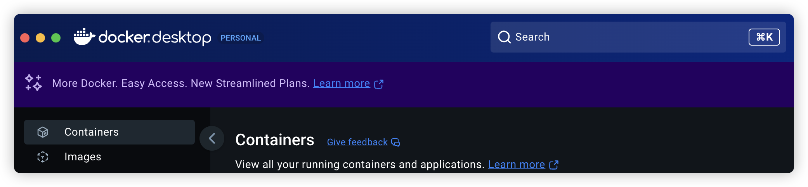

docker基础理解中最重要的概念就是**镜像（Image）**和**容器（Container）**

你可以这样简单地这样类比：

- **镜像（Image）**= **打包好的应用程序**，就像一个软件的安装包（比如 `.exe` 文件），它包含了应用的代码、依赖、环境配置等。
- **容器（Container）**= **运行中的应用**，就像你从安装包安装并运行的软件，它是镜像的“实例”，可以多个同时运行，互不影响。

所以，我们直接现在docker中下载相应的镜像，然后"安装应用(容器)"即可，比如我们要安装mysql，直接在docker中搜索mysql即可

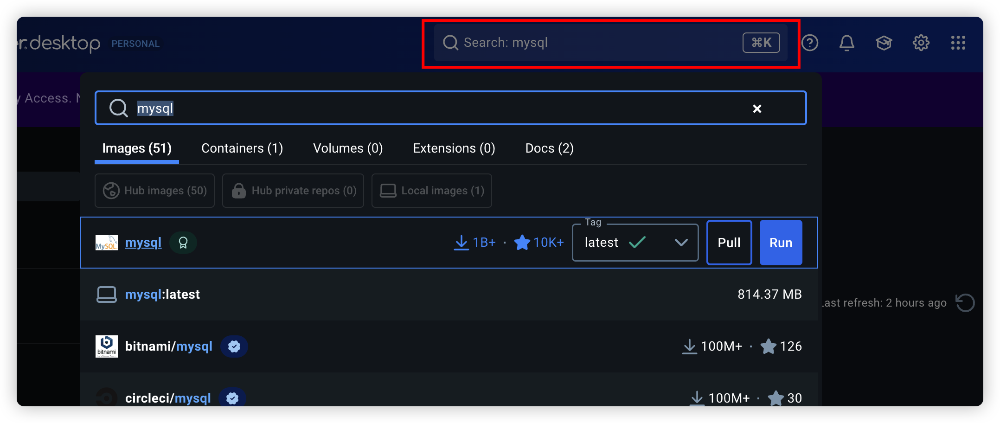

Image版本很多，有官方的，也有一些私人的，像mysql这种，我们直接下载官方版本的即可

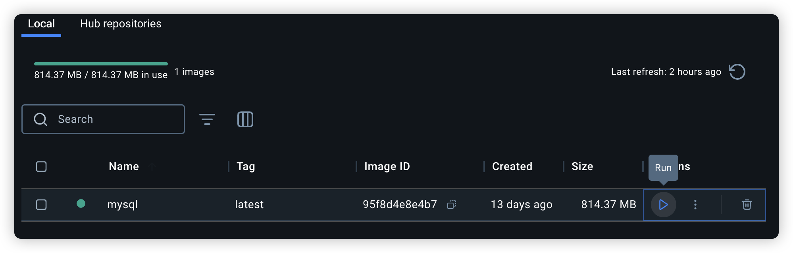

下载成功之后，我们就可以运行容器，当然，我们可以进行一些初始化的环境配置

主要是端口映射，以及本地目录映射和环境变量配置

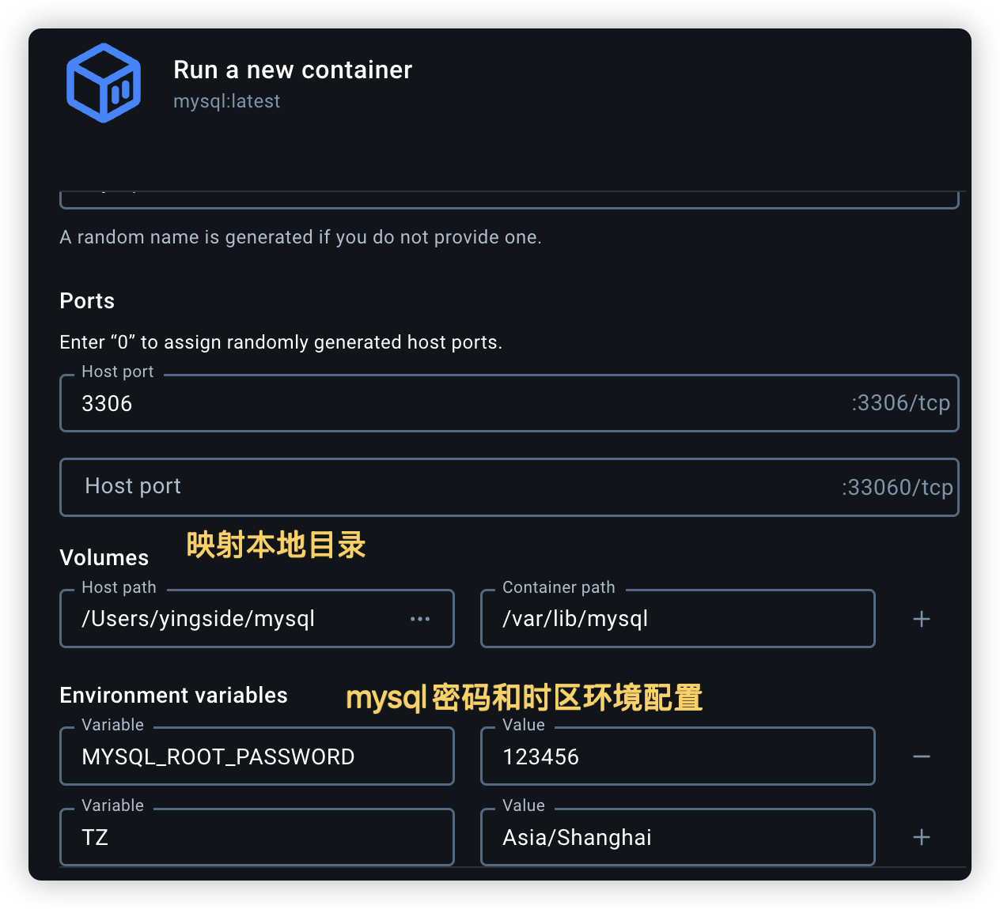

当然，如果你实在不会使用docker，直接去安装我们后面要用的mysql即可。

## mysql的GUI基本使用

mysql的GUI客户端很多，比如Workbench、Navicat等等，这里我们就选择免费的[Workbench](https://www.mysql.com/products/workbench/)

根据你的系统，选择对应的版本下载即可

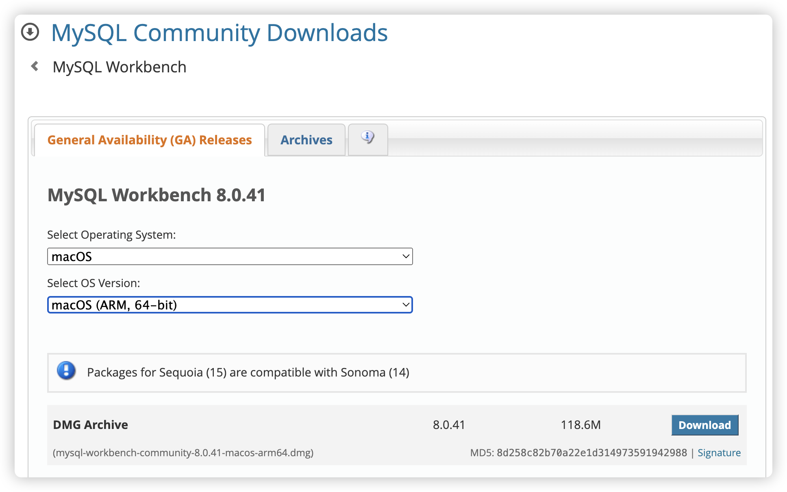

下载会提示你注册登录，可以直接选择跳过即可

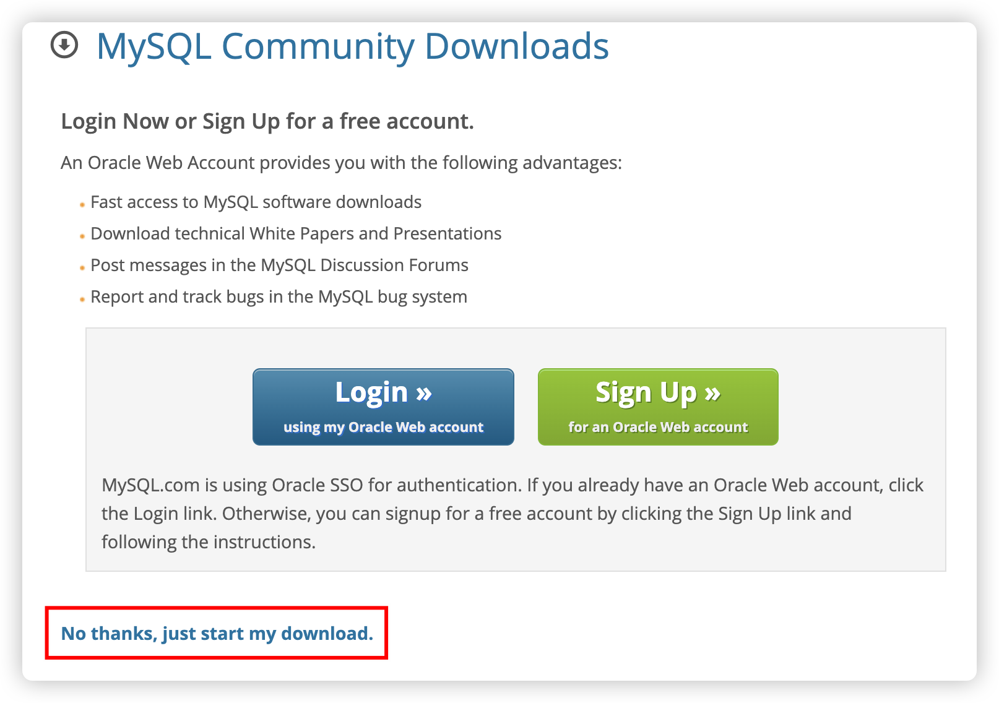

安装完成之后，创建新的数据库链接

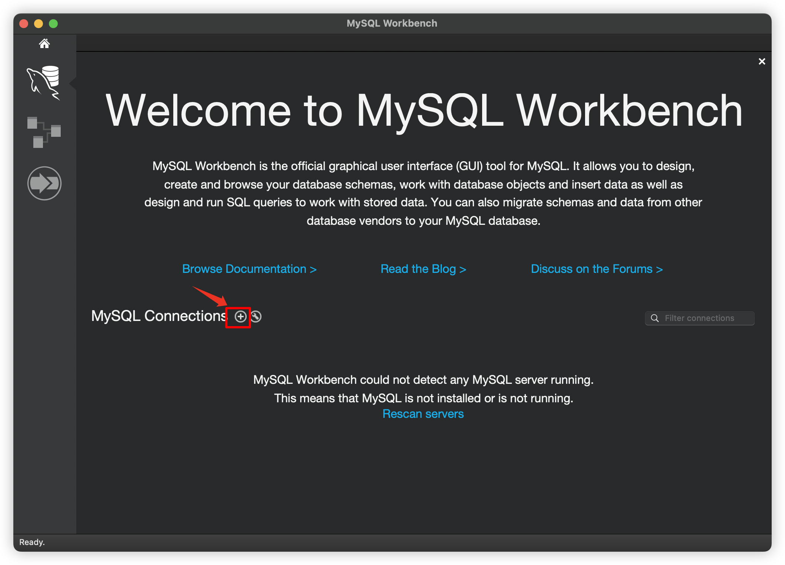

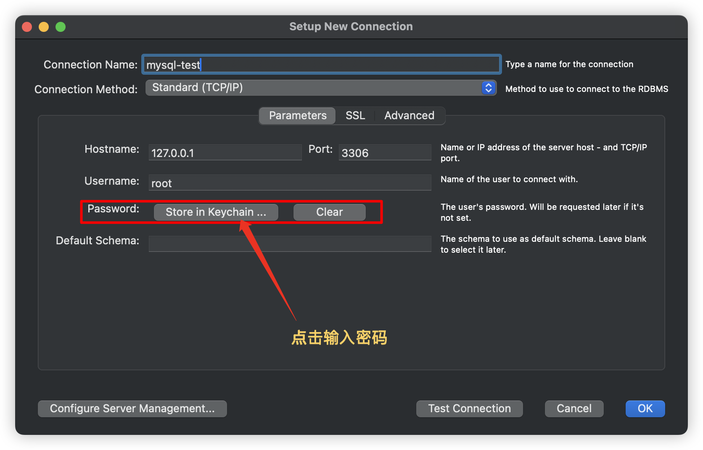

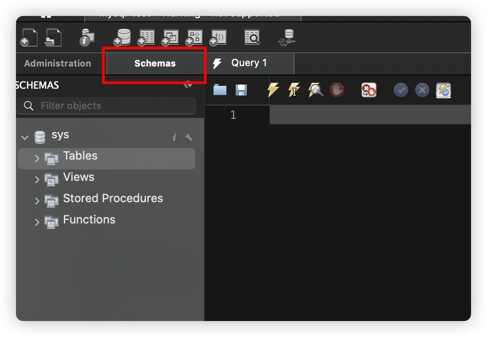

接下来其实就是简单的创建库，表等等操作了。

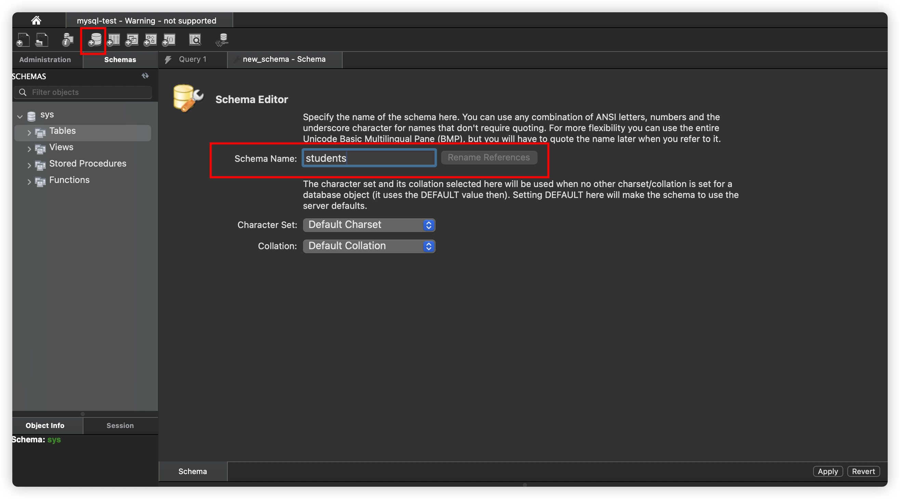

如果是window系统的话，建议指定一下字符集

接下来创建表，注意双击选择对应的库，进行创建

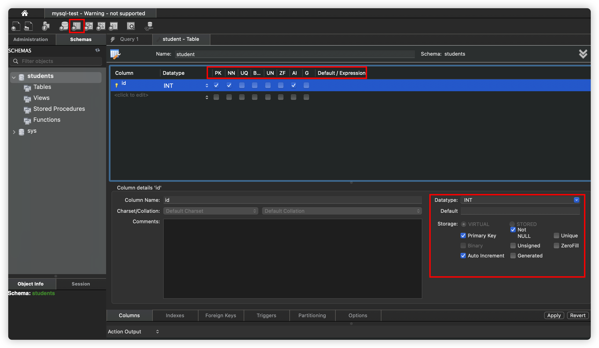

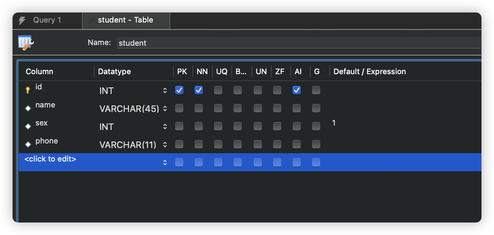

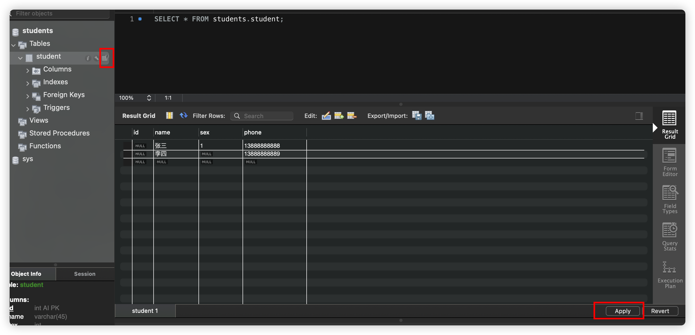

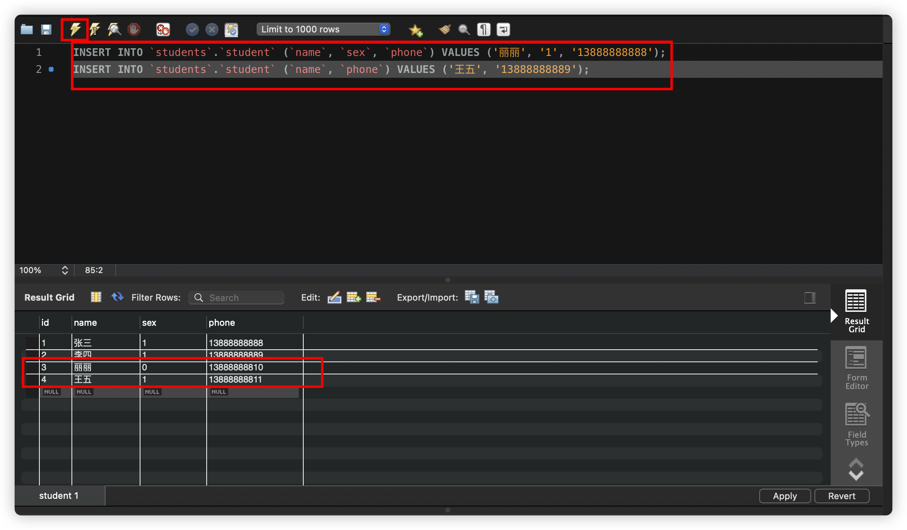

其他就不再一一介绍了，用什么样的GUI其实都一样。