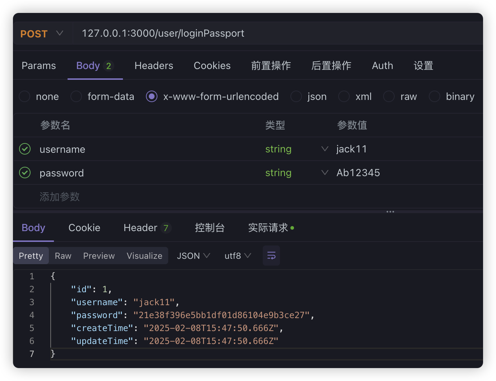
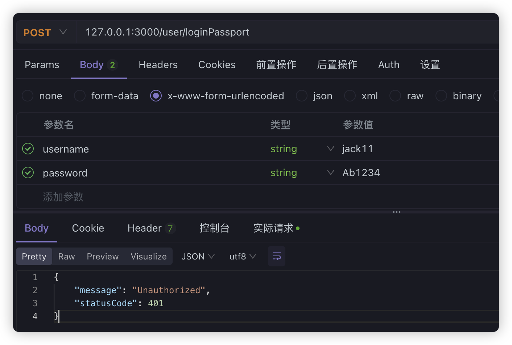
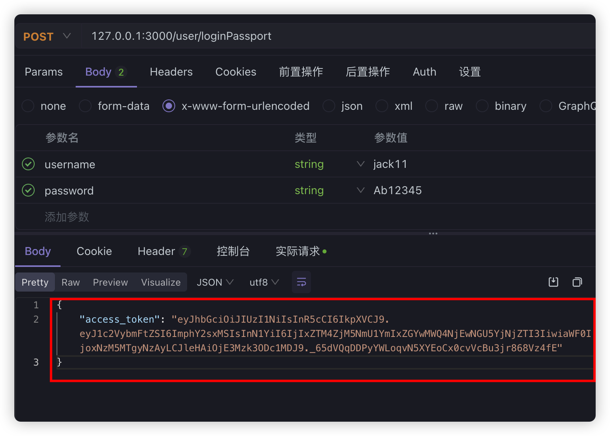
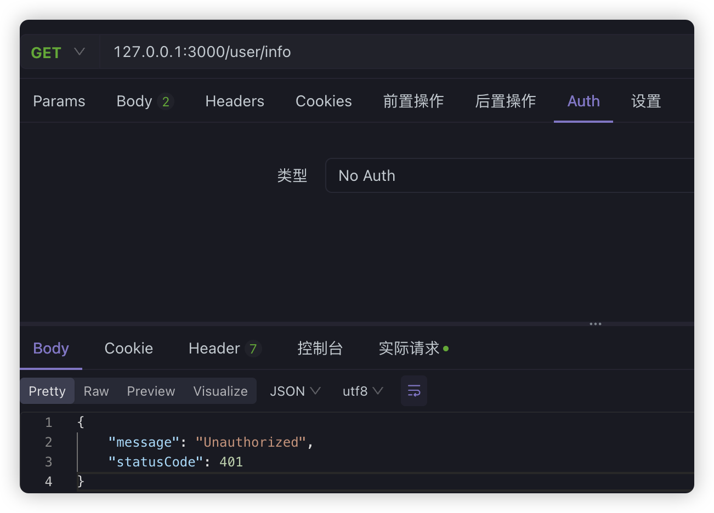
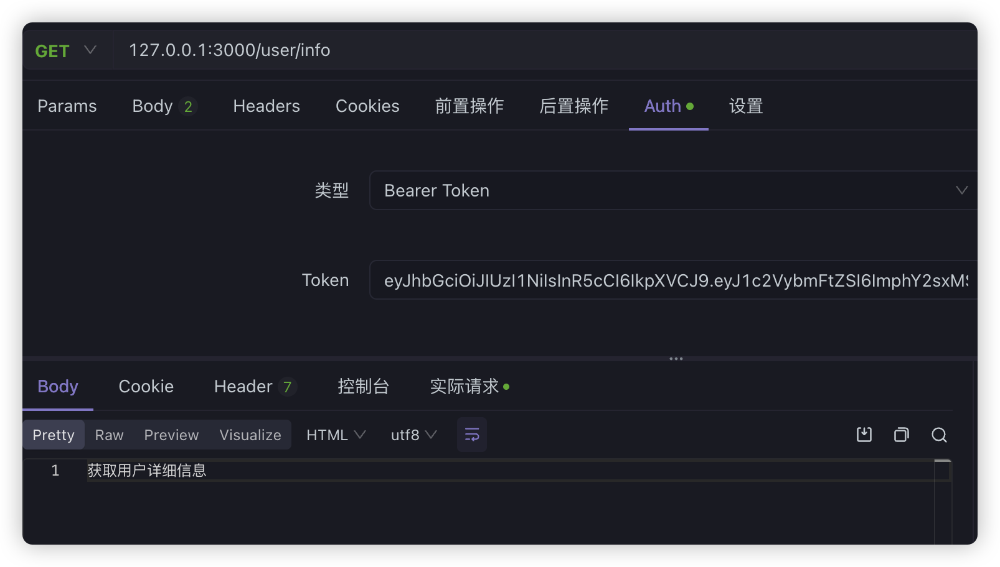

## Passport简化流程与循环引用问题

- Passport是最流行的 Node.js 身份验证库。之前时通过自定义路由守卫来拦截、抛出错误的。Passport这个库把这些都封装好了

```typescript
pnpm add @nestjs/passport passport passport-local passport-jwt -S
pnpm add @types/passport-local @types/passport-jwt -D
```

为了和之前的区分，这里使用Auth模块专门来验证用户信息

```shell
nest g mo auth
nest g s auth --no-spec
```

在`auth.service.ts`中处理用户验证逻辑

```typescript
@Injectable()
export class AuthService {
  @Inject(UserService)
  private userService: UserService;

  async validateUser(username: string, password: string): Promise<any> {
    const findUser = await this.userService.findOneByUsername(username);
    if (findUser && findUser.password === md5(password)) {
      return findUser;
    }
    return null;
  }
}
```

> **注意：**
>
> 这里需要留意**两个问题**
>
> **1、导出问题：**这里引用了User模块中的UserService，在User模块中，需要导出UserService，同理，如果到时候Auth模块中的AuthService需要在User模块中引入，同样需要导出
>
> **2、循环引用问题：**由于可能两个共享模块中，存在互相引用的问题，那么这样就会形成循环引用，这是不允许的，但是有时候我们可能不得不这么做，可以使用`forwardRef`函数来解决循环依赖的问题。`forwardRef`允许你创建一个延迟加载的模块或提供器引用，`从而避免在初始化时立即解析循环依赖`

**user.module.ts**

```typescript
import { Module, forwardRef } from "@nestjs/common";
import { UserService } from "./user.service";
import { UserController } from "./user.controller";
import { TypeOrmModule } from "@nestjs/typeorm";
import { User } from "./entities/user.entity";
import { AuthModule } from "src/auth/auth.module";

@Module({
  imports: [
    TypeOrmModule.forFeature([User]),
    forwardRef(() => AuthModule), // user模块可能会引用auth模块
  ],
  controllers: [UserController],
  providers: [UserService],
  exports: [UserService], // 导出UserService,其他模块可以引入
})
export class UserModule {}
```

**auth.module.ts**

```typescript
import { Module, forwardRef } from "@nestjs/common";
import { AuthService } from "./auth.service";
import { UserModule } from "src/user/user.module";
import { PassportModule } from "@nestjs/passport";

@Module({
  imports: [forwardRef(() => UserModule), PassportModule],
  providers: [AuthService],
  exports: [AuthService],
})
export class AuthModule {}
```

在auth模块中，由于我们要使用passport模块，所以我们先导入了**`PassportModule`模块**

我们上面已经有了AuthService的本地验证方法，接下来我们可以通过`Passport`实现简单的本地身份验证策略，直接创建一个名为`loca.strategy.ts`的文件，定义`LocalStrategy`类并继承`PassportStrategy`

```typescript
import { PassportStrategy } from "@nestjs/passport";
import { Strategy } from "passport-local";
import { AuthService } from "./auth.service";
import { Injectable, UnauthorizedException } from "@nestjs/common";

@Injectable()
export class LocalStrategy extends PassportStrategy(Strategy) {
  constructor(private authService: AuthService) {
    super();
  }

  async validate(username: string, password: string): Promise<any> {
    const findUser = await this.authService.validateUser(username, password);
    if (!findUser) {
      throw new UnauthorizedException();
    }
    return findUser;
  }
}
```

默认情况下，本地策略需要从**请求**中获取名为`username`何`password`的两个属性，**注意**本地策略要使用，需要注册为`provider`

```diff
import { Module, forwardRef } from '@nestjs/common';
import { AuthService } from './auth.service';
+import { LocalStrategy } from './local.strategy';
import { UserModule } from 'src/user/user.module';
import { PassportModule } from '@nestjs/passport';

@Module({
  imports: [
    forwardRef(() => UserModule),
    PassportModule,
  ],
+  providers: [AuthService, LocalStrategy],
  exports: [AuthService],
})
export class AuthModule {}
```

在User模块的`controller`中，为了和之前的路由区分，这里新建一个登录的路由：

```typescript
@UseGuards(AuthGuard('local'))
@Post('loginPassport')
async loginPassport(@Req() req) {
  return req.user;
}
```

现在如果登录成功，提示以下信息:



如果失败：



其实就是通过本地策略LocalStrategy，拦截了请求信息，然后处理了相关登录验证业务。

接下来同样**通过Passport来验证JWT，**首先我们需要在AuthModule中引入JwtModule，这相当于在模块中单独引入了JWT模块，我们之前的相当于是全局引入。并且我们还需要创建一个JwtStrategy并引入到模块

```diff
@Module({
  imports: [
    forwardRef(() => UserModule),
    PassportModule,
+    JwtModule.register({
+      secret: 'MySecret',
+      signOptions: { expiresIn: '7d' },
+    }),
  ],
+  providers: [AuthService, LocalStrategy, JwtStrategy],
  exports: [AuthService],
})
export class AuthModule {}
```

**jwt.strategy.ts**

```typescript
import { PassportStrategy } from "@nestjs/passport";
import { AuthService } from "./auth.service";
import { Injectable } from "@nestjs/common";
import { ExtractJwt, Strategy } from "passport-jwt";

@Injectable()
export class JwtStrategy extends PassportStrategy(Strategy) {
  constructor(private authService: AuthService) {
    super({
      jwtFromRequest: ExtractJwt.fromAuthHeaderAsBearerToken(),
      ignoreExpiration: false,
      secretOrKey: "MySecret",
    });
  }

  validate(payload: any) {
    return { username: payload.username, password: payload.sub };
  }
}
```

其中：

- jwtFromRequest：表示从header中的Authorization属性中获取Bearer的token值
- ignoreExpiration：表示不忽视token过期的情况，过期会返回401

最后实现validate方法，并返回一个user对象。

在`auth.service.ts`文件中，新增一个login方法

```typescript
import { Inject, Injectable } from "@nestjs/common";
import { UserService } from "src/user/user.service";
import * as md5 from "md5";
import { LoginUserDto } from "src/user/dto/login-user.dto";
import { JwtService } from "@nestjs/jwt";

@Injectable()
export class AuthService {
  @Inject(UserService)
  private userService: UserService;
  @Inject(JwtService)
  private jwtService: JwtService;

  async validateUser(username: string, password: string): Promise<any> {
    const findUser = await this.userService.findOneByUsername(username);
    if (findUser && findUser.password === md5(password)) {
      return findUser;
    }
    return null;
  }

  async login(user: LoginUserDto) {
    const payload = { username: user.username, sub: user.password };
    return {
      access_token: this.jwtService.sign(payload),
    };
  }
}
```

现在，我们在UserController中调用login的时候，还需要生成JWT的值

```typescript
@Inject(AuthService)
private authService: AuthService;

@UseGuards(AuthGuard('local'))
@Post('loginPassport')
async loginPassport(@Req() req) {
  return this.authService.login(req.user);
}
```

现在我们登录一下：



等于现在我们生成这个JWT的值之后，以后要访问有权限的路由，就必须在头信息上加上jwt，不然验证不通过，比如我们直接在info路由上使用现在的处理

```typescript
@Get('info')
// @UseGuards(LoginGuard)
@UseGuards(AuthGuard('jwt'))
getUserInfo() {
  return '获取用户详细信息';
}
```

如果没有带token：



带上token之后：



## Passport 的优点

Passport 的核心价值不是「比自写 Guard 更强」，而是**把「怎么拿凭证」和「凭证是否有效」标准化、可插拔**。

### 与自写守卫（LoginGuard）对比

| | 自写守卫（LoginGuard） | Passport |
|---|---|---|
| 本质 | 一个 Guard 里做完所有事 | Guard + Strategy 分工，Strategy 可复用 |
| 代码量 | 少，逻辑集中 | 多，需要 Strategy、Module、Service 配合 |
| 透明度 | 高，逐行能看懂 | 低，部分流程封装在框架/库里 |
| 扩展性 | 自己加 OAuth 等要重写 | 换 Strategy 即可（Google/GitHub 等） |

自写 `LoginGuard` 的流程很直观：**取 Header → 解析 Bearer → 验 JWT → 挂 req.user → 放行**。

Passport 则拆成「策略 + 守卫」：`LocalStrategy` 负责用户名密码验证，`JwtStrategy` 负责从 Header 取 token 并决定 `req.user` 长什么样，控制器统一用 `@UseGuards(AuthGuard('jwt'))`。

### 主要优点

**1. 策略可插拔，多种登录方式并存**

每种认证方式是一个 Strategy，控制器写法统一：

```typescript
@UseGuards(AuthGuard('local'))   // 用户名密码
@UseGuards(AuthGuard('jwt'))     // JWT
@UseGuards(AuthGuard('google'))  // Google OAuth
@UseGuards(AuthGuard('github'))  // GitHub OAuth
```

自写 Guard 的话，每加一种登录方式通常要再写一个 Guard，或在一个 Guard 里堆很多 `if/else`。

**2. 生态成熟，第三方登录几乎开箱即用**

社区已有大量现成 Strategy，例如 `passport-google-oauth20`、`passport-github2`、`passport-saml`（企业 SSO）等。自己实现 OAuth 回调、state 校验、token 交换，工作量和踩坑都不少；Passport 把这些流程封装好了。

**3. 职责分离，大项目更好维护**

| 组件 | 职责 |
|------|------|
| `LocalStrategy` | 用户名密码怎么验 |
| `JwtStrategy` | Token 从哪取、验完后 `req.user` 是什么 |
| `AuthService` | 查库、发 token 等业务逻辑 |
| `AuthGuard('jwt')` | 统一入口，不关心具体策略 |

**4. 控制器更「声明式」**

登录接口可以写成：

```typescript
@UseGuards(AuthGuard('local'))
@Post('login')
login(@Req() req) {
  return this.authService.login(req.user);  // Strategy 已把 user 挂好
}
```

业务方法只关心「已登录用户是谁」，不用在每个接口里重复解析 token。

**5. 跨框架经验可迁移**

Passport 在 Express、Nest 等 Node 框架里思路一致，读懂一个 Nest + Passport 项目，换团队或看开源代码时成本更低。

### 和 LoginGuard 的对应关系

| LoginGuard 做的事 | Passport 对应 |
|---|---|
| 从 Header 取 token | `ExtractJwt.fromAuthHeaderAsBearerToken()` |
| `jwtService.verify()` | Strategy 内部 + `secretOrKey` |
| `request.user = info.user` | `validate()` 的返回值 |
| `throw UnauthorizedException` | validate 抛错或返回 false |

`AuthGuard('jwt')` 相当于一个通用的「按策略名调用对应验证逻辑」的 Guard。

### 典型使用场景

**适合用 Passport：**

| 场景 | 原因 |
|------|------|
| 多种登录并存 | 账号密码 + 手机验证码 + 微信/Google |
| 第三方 OAuth / SSO | 直接用现成 Strategy，少写 OAuth 细节 |
| B2B / 企业应用 | SAML、LDAP、Azure AD 等有成熟方案 |
| 团队规范 / 中大型项目 | 认证模块独立，Strategy 可单测、可替换 |
| API + 传统 Session 混合 | `passport-local` + `passport-jwt` 可组合 |
| 阅读他人 Nest 项目 | 业界常见写法，文档和示例多 |

**自写 Guard 就够用：**

| 场景 | 原因 |
|------|------|
| 单一 JWT 鉴权 | 逻辑简单，一个 LoginGuard 几十行搞定 |
| 学习 / 练手 / 小项目 | 透明、好调试、概念少 |
| 定制极强的校验 | 不想被 Strategy 约定束缚时 |

> **小结：** Passport 的「点」在于**扩展性和标准化**，不在于 JWT 场景下比自写 Guard 更简单。只有 JWT 登录 + 几个受保护接口时，LoginGuard 完全够用；等要接 Google 登录、或同一套 API 支持多种认证时，Passport 节省的成本会明显超过学习成本。

## 通过环境变量获取配置信息

前面在配置MySQL和JWT的时候，我们把一些字符串信息硬编码到代码中了，然而生成环境中并不推荐这么做，而是应该使用环境变量或者配置服务来管理，因此，我们可以在项目根目录下创建一个`.env`文件来维护环境变量

```typescript
DB_USER=root
DB_HOST=localhost
DB_PORT=3306
DB_PASSWORD=123456
DB_DATABASE=login_test
JWT_SECRET=MySecret
JWT_EXPIRE_TIME=7d
```

要获取配置信息，还需要安装`@nestjs/config`包

```shell
pnpm add @nestjs/config -S
```

并且，在AppModule中需要引入ConfigModule模块，而且最好将配置模块直接注入全局：

```typescript
import { ConfigModule } from '@nestjs/config';

@Module({
  imports: [
    ConfigModule.forRoot({
      isGlobal: true,
    }),
   ]
  //......
})
```

为了获取配置信息，我们需要把TypeORM模块改成工厂函数的方式进行注册，并且需要**注入`ConfigService`**获取配置信息

```typescript
TypeOrmModule.forRootAsync({
  inject: [ConfigService],
  useFactory: async (configService: ConfigService) => ({
    type: 'mysql',
    host: configService.get<string>('DB_HOST'),
    port: configService.get<number>('DB_PORT'),
    username: configService.get<string>('DB_USER'),
    password: configService.get<string>('DB_PASSWORD'),
    database: configService.get<string>('DB_DATABASE'),
    synchronize: true,
    logging: true,
    autoLoadEntities: true,
    entities: [__dirname + '/**/*.entity{.ts,.js}'],
    timezone: 'Z',
  }),
}),
```

> 注意：`TypeOrmModule.forRootAsync`需要至少Node20以上的版本。

我们在Auth模块中，动态引入Jwt

```typescript
JwtModule.registerAsync({
  imports: [ConfigModule],
  inject: [ConfigService],
  useFactory: (configService: ConfigService) => ({
    secret: configService.get<string>('JWT_SECRET'),
    signOptions: {
      expiresIn: configService.get<string>('JWT_EXPIRE_TIME'),
    },
  }),
}),
```
