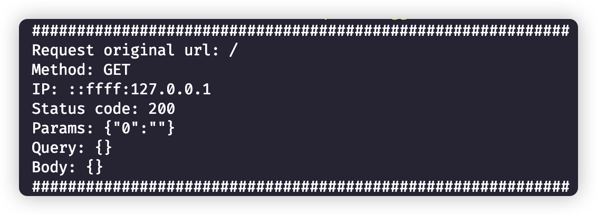
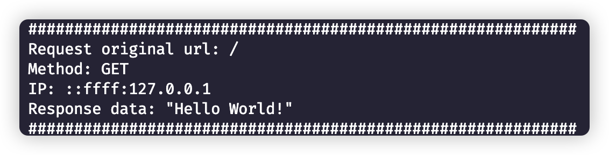
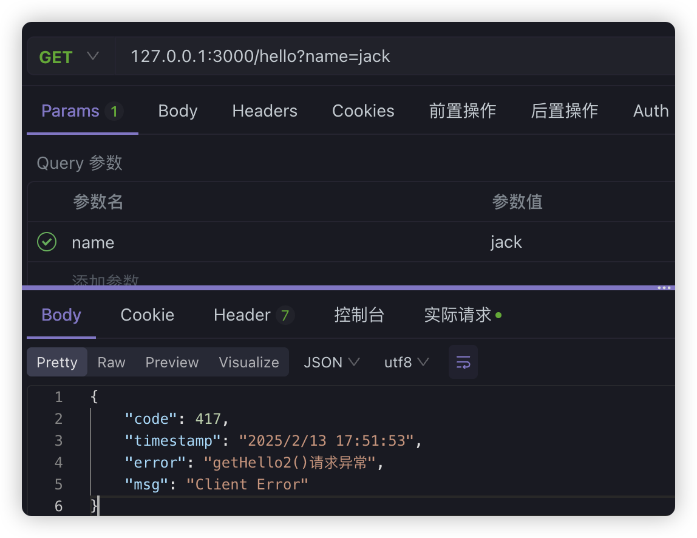
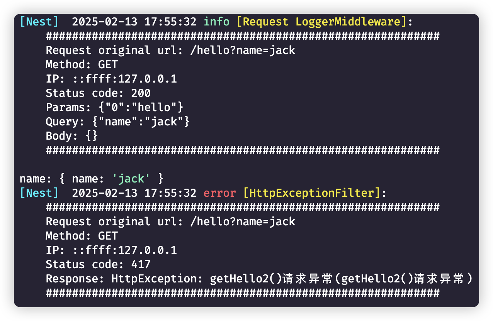

## 面向切面的日志处理

在某些特殊业务场景中，开发人员`可能会选择手动记录日志`，但是`在处理请求、响应和捕获服务异常等等常见场景时，手动记录日志可能效率较低。`为了减少冗余的日志代码并且统一日志格式，通常会采用**全局日志记录的策略**，比如通过AOP的方式来实现。

> AOP（Aspect-Oriented Programming，面向切面编程） 的核心思想是：把和「主业务」无关、但又到处都要做的横切逻辑（日志、鉴权、事务、计时等）从业务代码里抽出来，集中写在一处，在请求/方法执行的固定节点自动执行，而不是在每个 Controller、Service 里重复写 logger.log(...)。

### 中间件日志统计

在Nest中，中间件可以在路由处理程序之前或者之后执行函数。它们可以操作请求和响应对象，或者执行其他运行时确定的任务。`一般情况下，中间件可以用于收集请求参数、请求体、请求方法、IP地址等等信息，这些信息对于后续的问题排查也是比较重要的`。

我们可以实现一个日志记录的中间件，为了统一，创建一个`common`的文件夹，我们不同的拦截操作文件都放在这里面，在这个文件夹下创建中间件，直接使用命令：

```shell
nest g mi logger --flat --no-spec
```

```typescript
import { Inject, Injectable, NestMiddleware } from "@nestjs/common";
import { NextFunction, Request, Response } from "express";
import { MyLogger } from "src/logger/MyLogger";

@Injectable()
export class LoggerMiddleware implements NestMiddleware {
  @Inject(MyLogger)
  private logger: MyLogger;

  use(req: Request, res: Response, next: NextFunction) {
    const statusCode = res.statusCode;
    const logFormat = `
    ############################################################
    Request original url: ${req.originalUrl}
    Method: ${req.method}
    IP: ${req.ip}
    Status code: ${statusCode}
    Params: ${JSON.stringify(req.params)}
    Query: ${JSON.stringify(req.query)}
    Body: ${JSON.stringify(req.body)}
    ############################################################
    `;
    next();

    if (statusCode >= 500) {
      this.logger.error(logFormat, "Request LoggerMiddleware");
    } else if (statusCode >= 400) {
      this.logger.warn(logFormat, "Request LoggerMiddleware");
    } else {
      this.logger.log(logFormat, "Request LoggerMiddleware");
    }
  }
}
```

为了中间件应用于所有路由上，可以在AppModule上进行处理：

```typescript
@Module({
  imports: [LoggerModule],
  controllers: [AppController],
  providers: [AppService],
})
export class AppModule implements NestModule {
  configure(consumer: MiddlewareConsumer) {
    consumer.apply(LoggerMiddleware).forRoutes("*");
  }
}
```

访问`127.0.0.1:3000/`打印如下结果：



### 拦截器日志统计

同样，我们可以使用拦截器实现HTTP响应成功的日志功能。

同样在common文件夹下，使用命令直接创建拦截器

```shell
nest g itc response --flat --no-spec
```

```typescript
import {
  CallHandler,
  ExecutionContext,
  Inject,
  Injectable,
  NestInterceptor,
} from "@nestjs/common";
import { map, Observable } from "rxjs";
import { MyLogger } from "src/logger/MyLogger";

@Injectable()
export class ResponseInterceptor implements NestInterceptor {
  @Inject(MyLogger)
  private logger: MyLogger;

  intercept(context: ExecutionContext, next: CallHandler): Observable<any> {
    const req = context.switchToHttp().getRequest();
    return next.handle().pipe(
      map((data) => {
        const logFormat = `
        ############################################################
        Request original url: ${req.originalUrl}
        Method: ${req.method}
        IP: ${req.ip}
        Response data: ${JSON.stringify(data)}
        ############################################################
        `;
        this.logger.log(logFormat, "Response LoggerInterceptor");
        return data;
      }),
    );
  }
}
```

在AppModule中注册拦截器

```diff
+import { ResponseInterceptor } from './common/response.interceptor';

@Module({
  imports: [LoggerModule],
  controllers: [AppController],
  providers: [
    AppService,
+    {
+      provide: APP_INTERCEPTOR,
+      useClass: ResponseInterceptor,
+    },
  ],
})
export class AppModule implements NestModule {
  configure(consumer: MiddlewareConsumer) {
    consumer.apply(LoggerMiddleware).forRoutes('*');
  }
}

```



### 过滤器日志统计

过滤器也常常用来进行统计日志，比如Http的异常信息收集，同样，我们在common文件夹下创建filter过滤器

```typescript
nest g f http-exception --flat --no-spec
```

```typescript
import { ArgumentsHost, Catch, ExceptionFilter, Inject } from "@nestjs/common";
import { MyLogger } from "src/logger/MyLogger";

@Catch()
export class HttpExceptionFilter implements ExceptionFilter {
  @Inject(MyLogger)
  private logger: MyLogger;
  catch(exception: any, host: ArgumentsHost) {
    const ctx = host.switchToHttp();
    const response = ctx.getResponse();
    const request = ctx.getRequest();
    const status = exception.getStatus();
    const exceptionResponse = exception.getResponse();
    const logFormat = `
    ############################################################
    Request original url: ${request.originalUrl}
    Method: ${request.method}
    IP: ${request.ip}
    Status code: ${status}
    Response: ${
      exception.toString() +
      `(${exceptionResponse?.message || exceptionResponse})`
    }
    ############################################################
    `;
    this.logger.error(logFormat, "HttpExceptionFilter");
    response.status(status).json({
      code: status,
      timestamp: new Date().toLocaleString(),
      error: exceptionResponse?.message || exception.message,
      msg: `${status >= 500 ? "Service Error" : "Client Error"}`,
    });
  }
}
```

同样，在AppModule上应用

```typescript
@Module({
  imports: [LoggerModule],
  controllers: [AppController],
  providers: [
    AppService,
    // 应用拦截器
    {
      provide: APP_INTERCEPTOR,
      useClass: ResponseInterceptor,
    },
    // 应用过滤器
    {
      provide: APP_FILTER,
      useClass: HttpExceptionFilter,
    },
  ],
})
export class AppModule implements NestModule {
  configure(consumer: MiddlewareConsumer) {
    consumer.apply(LoggerMiddleware).forRoutes("*");
  }
}
```

稍微修改一下Controller

```typescript
@Get('hello')
getHello2(@Query() name: string): string {
  console.log('name:', name);
  throw new HttpException(
    'getHello2()请求异常',
    HttpStatus.EXPECTATION_FAILED,
  );
  return 'hello world2';
}
```



后台打印：



## 总结

- 请求入参、IP、路由 → 中间件更合适。
- 正常返回的业务数据 → 拦截器更合适（中间件做不到）。
- 异常与统一错误响应 → 过滤器更合适（拦截器成功分支走不到）。
